# Lulyssia stickers

Lulyssia's sticker set and every place it appears in the dashboard. The images are in `src/assets/emote/` (lossless WebP, 512px max), and the toast lines are in `src/lib/stickers.ts`.

## Where stickers appear

| Place | How the sticker is picked | Source |
|---|---|---|
| Welcome greeting (Home) | One random greeting per page load, each with its own sticker | `WelcomeMessage.tsx` |
| Confirm dialog (delete, clear…) | A new random line and sticker each time the dialog opens | `LulyssiaConfirmDialog.tsx` |
| Toasts: success | Random line from the **success** set, with a sticker beside the message and her line under it | `lib/toast.tsx`, `ui/toaster.tsx` |
| Toasts: error | Random line from the **error** set | same |
| Toasts: info / plain | A sticker from the **info** set. A plain toast that is already in her voice gets the sticker only. | same |
| "Collapse all" with nothing open | Always `no` | `HomePage.tsx` |
| Back-to-top skill toast | Always `trigger_chibi` (its own layout) | `Index.tsx` |

Toasts that already have a description (for example "Select the code and copy it manually.") keep that text and get only the sticker, so useful information is never replaced.

## The stickers

### yes
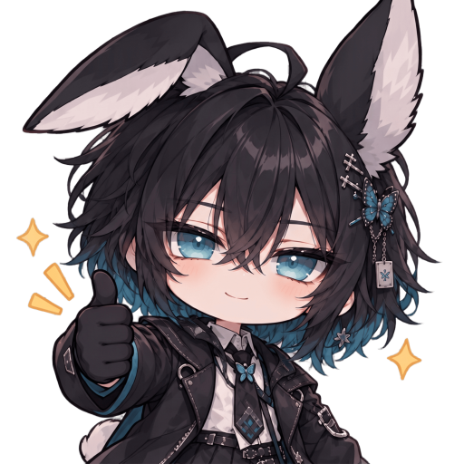

- **Greeting:** "Oh, {nickname}. Right on time, as I expected." 🦋
- **Success toast:** "Good. Exactly as I deduced." / "Nicely done. You have my approval~"

### coffee
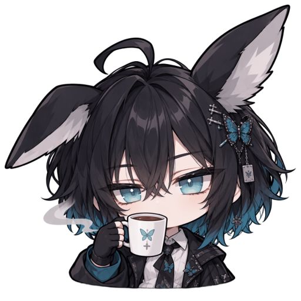

- **Greeting:** "Coffee's ready. So is your agenda." ☕
- **Confirm dialog:** "Let me finish my coffee before you decide."
- **Success toast:** "Filed away. Now, where was my coffee..." / "Noted over a sip of coffee ☕"

### contemplate
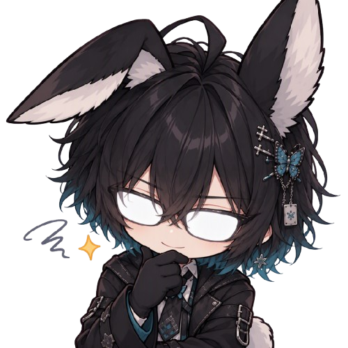

- **Greeting:** "Welcome back. I've already looked over today's case." 🔍
- **Confirm dialog:** "Hmm... let me consider this for a moment."
- **Info toast:** "Hmm... interesting."

### suspicious
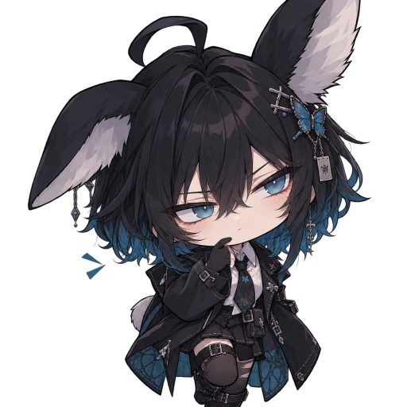

- **Greeting:** "Hmm... you look like you're hiding an unfinished task." 👀
- **Confirm dialog:** "Are you really sure about this?"
- **Error toast:** "Suspicious... that should have worked."
- **Info toast:** "I'll keep an eye on it."

### polaroid
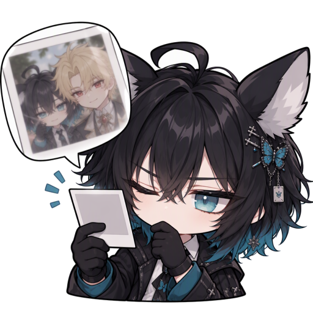

- **Greeting:** "I took a snapshot of your progress. Let's add to it." 📸
- **Confirm dialog:** "Let me take a picture first, just in case."
- **Success toast:** "Snap. Logged as evidence."
- **Info toast:** "I'll remember that."

### ritualing
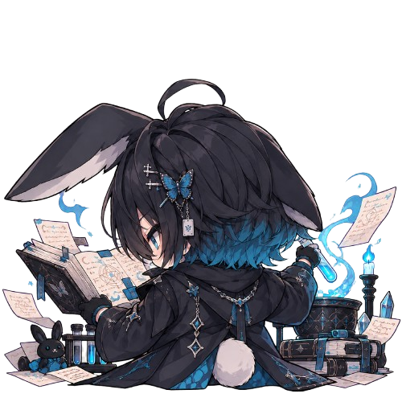

- **Greeting:** "Hold on, the files are almost sorted... there. Welcome back." 📜
- **Success toast:** "All in order. I checked twice."
- **Info toast:** "Leave the rest to me."

### restpointing
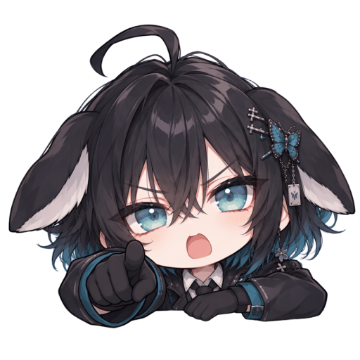

- **Greeting:** "There you are! Your tasks won't finish themselves, you know." 👉
- **Confirm dialog:** "Hold on, {nickname}."
- **Success toast:** "See? That wasn't so hard."
- **Info toast:** "Just so you know~"

### resting
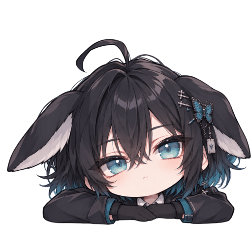

- **Greeting:** "Taking it slow today? I don't mind keeping you company." 🌙
- **Info toast:** "Noted~"

### mocking
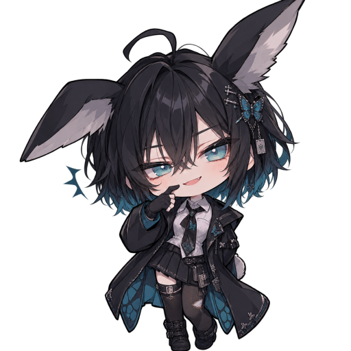

- **Greeting:** "Back already? Hmhm~ couldn't stay away?" 😏
- **Confirm dialog:** "Hmhm~ hope you won't regret this."
- **Success toast:** "Hmhm~ took you long enough."

### trigger_chibi
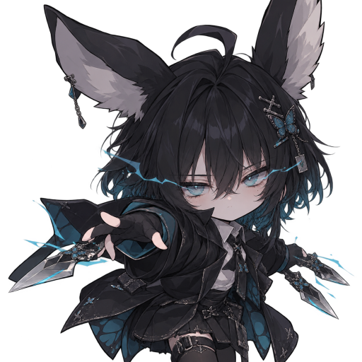

- **Success toast:** "Case closed 🦋"
- **Back-to-top skill toast:** "Skill activated" plus a random line, e.g. "Too slow~ I'm already at the top."

### sleep
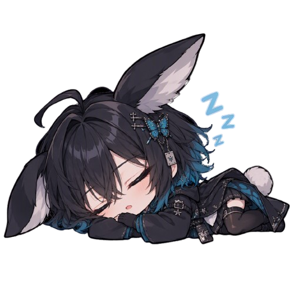

- **Greeting:** "Mm... oh, you're here. I was only resting my eyes." 💤

### sleep_annoyed
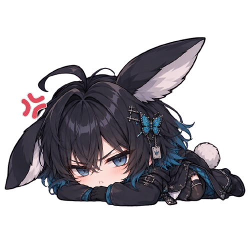

- **Greeting:** "Five more minutes... fine. Let's get to work." 😤
- **Confirm dialog:** "You woke me up for this? Fine, decide."
- **Error toast:** "Ugh. Wake me when the server behaves."

### startle
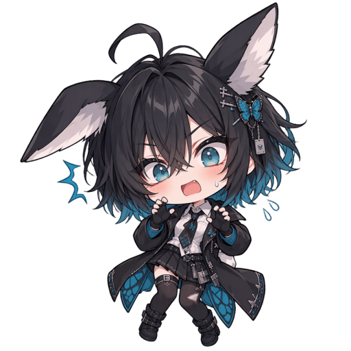

- **Greeting:** "Wha-! Oh, it's just you. Hi, {nickname}." ❗
- **Confirm dialog:** "Wha-! You're doing what?"
- **Error toast:** "Wha-! Something went wrong!"

### objection
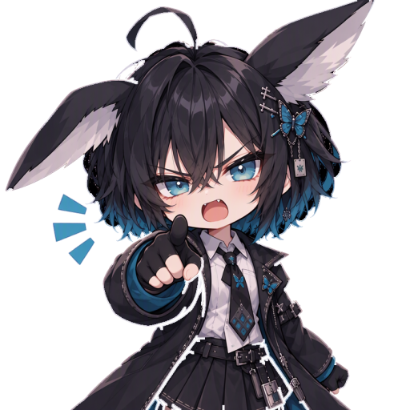

- **Greeting:** "Objection! You said you'd come back earlier." 💢
- **Confirm dialog:** "Objection! Think this through first."
- **Error toast:** "Objection! That was refused."

### no
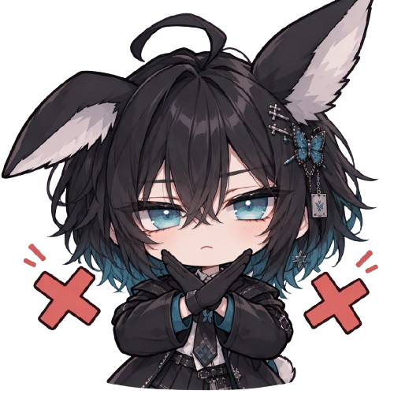

- **Greeting:** "Skipping your tasks today? No. Absolutely not." 🙅
- **Confirm dialog:** "I'd rather you didn't... but it's your call."
- **Error toast:** "Nope. That one didn't go through."
- **"Collapse all" pout:** "Hmph! I can't collapse anything — every block is already closed! Expand at least one first, okay?"

### unconfident
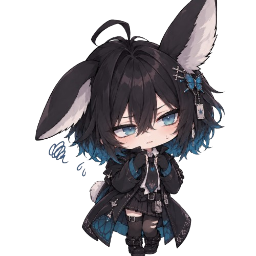

- **Greeting:** "Um... I think I planned today well? Take a look." 😥
- **Confirm dialog:** "Um... are we sure this is a good idea?"
- **Error toast:** "Um... I may have dropped that one."

### notsochill
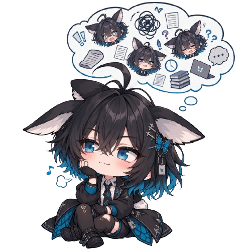

- **Greeting:** "Too many deadlines in my head... help me clear a few, {nickname}?" 💭
- **Confirm dialog:** "Too many choices... just confirm it, okay?"
- **Error toast:** "Too much at once... give it a moment and try again."

## Example toasts

How a toast looks with her added. The **bold** text is the app's own message; the *italic* line is Lulyssia's.

| Action | Sticker (random) | Toast |
|---|---|---|
| Create a task |  | **Task created successfully!** *Good. Exactly as I deduced.* |
| Update an event |  | **Event updated successfully!** *Snap. Logged as evidence.* |
| Delete a tag |  | **Tag deleted** *Filed away. Now, where was my coffee...* |
| Save fails |  | **Failed to update task. Please try again.** *Ugh. Wake me when the server behaves.* |
| Upload too big |  | **photo.png exceeds 25MB** *Objection! That was refused.* |
| Wrong password |  | **Invalid login credentials** *Wha-! Something went wrong!* |
| Bulk pin interests |  | **3 interest(s) pinned** *See? That wasn't so hard.* |
| Copy LINE code |  | **Copied** Link code copied to clipboard. *(own description kept)* |
| "Request Lulyssia help" sort |  | Target locked on the deadlines! Sorted and ready, {nickname}! 🎯 *(already her voice, sticker only)* |
| iOS install hint |  | **Install on iOS** Tap the share button in Safari, then 'Add to Home Screen'. |

## Adding a sticker or line

1. Convert the art to a lossless WebP in `src/assets/emote/`: `cwebp -lossless -z 9 in.png -o lulyssia_name.webp (add -resize 512 0 when the art is bigger than 512px)`
2. Add it to `STICKERS` in `src/lib/stickers.ts`.
3. Use it in `TOAST_LINES` (success / error / info), in the greetings in `WelcomeMessage.tsx`, or in the dialog lines in `LulyssiaConfirmDialog.tsx`. `{nickname}` is replaced with the user's saved nickname.
